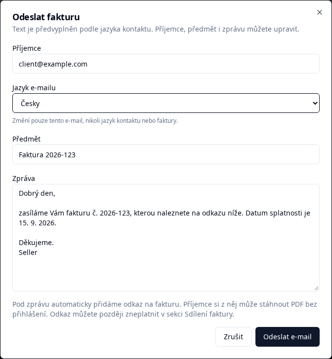
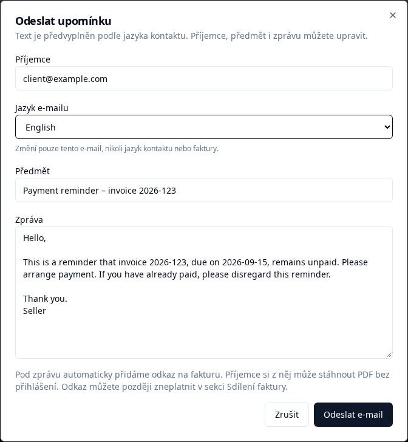

# App screenshots

These screenshots document the actual UI for contributors. They use synthetic fixture data, not customer invoices or a production account. The application interface is Czech; the email language can be changed independently.

## Invoice email composer

Open an invoice and choose **Odeslat fakturu**. Recipient and email language default to the contact. The subject and body are editable; changing the language affects only this email. A share link is appended when sending.



## Payment reminder composer

Choose **Odeslat upomínku** on an unpaid invoice. This example uses an English-speaking contact, so the reminder is prefilled in English.



## Refreshing the screenshots

From the repository root after installing dependencies:

```sh
pnpm exec playwright install chromium
pnpm docs:screenshots
```

The dedicated [Playwright configuration](../../playwright.docs.config.ts) starts the frontend and runs the [mocked email composer workflow](../../e2e/invoice-email.spec.ts). It needs no backend or database and sends no real email. Normal E2E runs do not overwrite these images. If a development frontend is already running on port 5173, it is reused.

Captures use Chromium, a 1440 × 1100 viewport, 1× scale, and light mode. For documentation only, the capture helper expands the message field when necessary to show the full draft; it does not alter the app's default layout. Images are cropped to the dialog to keep the documentation focused. Inspect the PNGs after regenerating them and commit them alongside the corresponding UI changes.

For future screens, use descriptive, stable filenames in this folder, add a short explanation here, and provide a reproducible capture using synthetic data. Never include personal data, credentials, real share links, or customer details.
